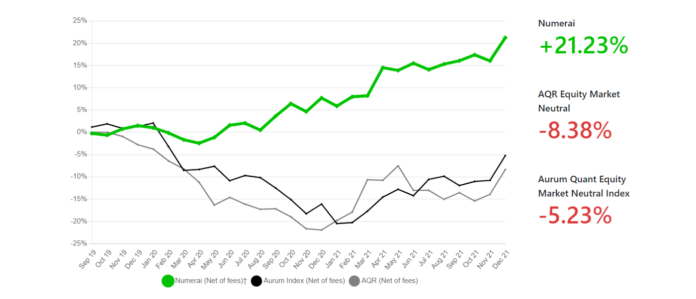
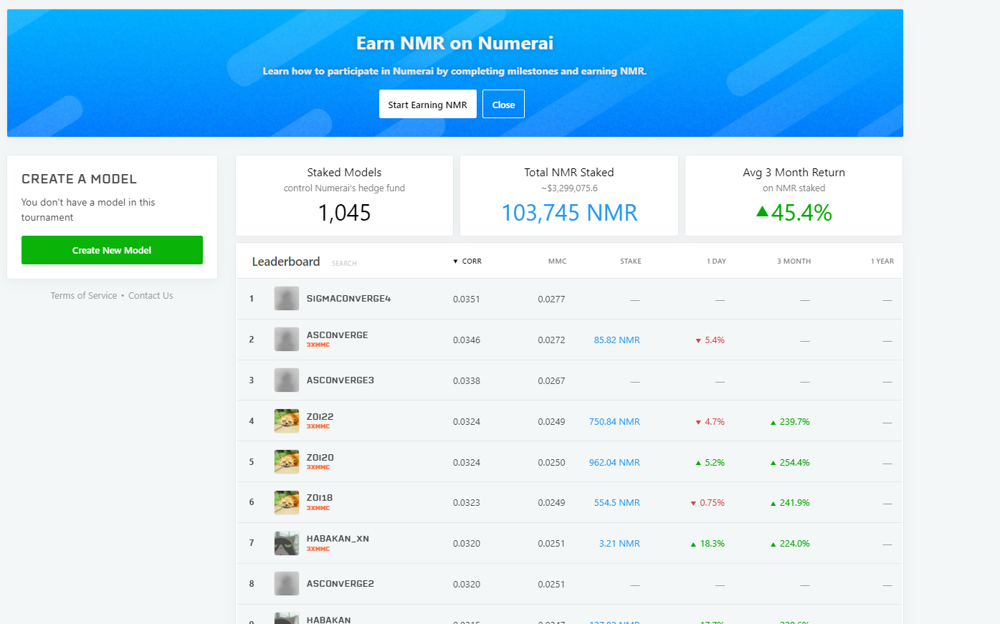
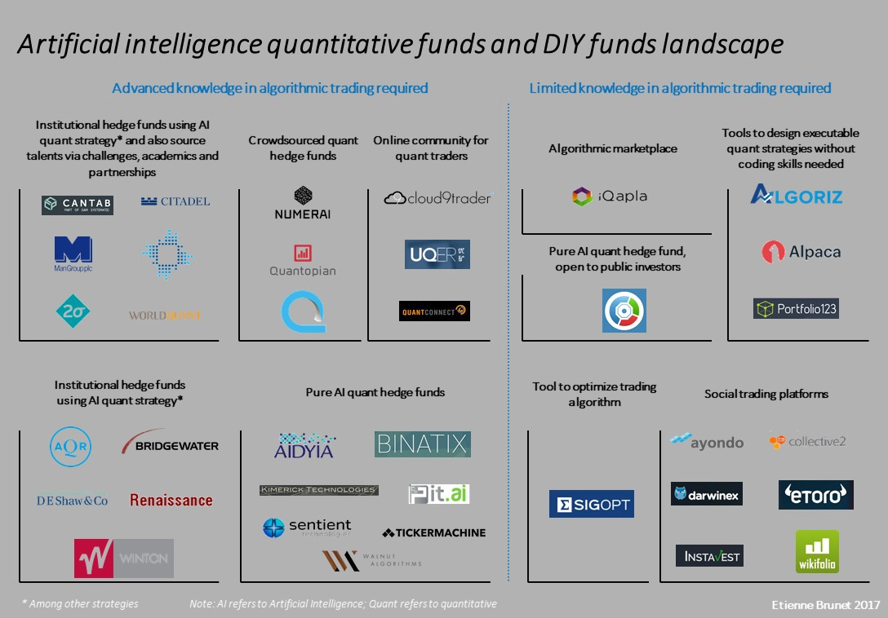

NumerAI was founded by Richard Craib in October 2015. NumerAI's goal is to become the world's last hedge fund. The product initially came about when the founder Craib realized AI trading required various people to have access to data, in order to solve one of the most difficult solutions in data science, cracking the financial market. By leveraging the power of decentralization, NumerAI aims to be the last hedge fund. And Richard Craigs most recent [blog post](https://medium.com/numerai/numerai-outperforms-market-neutral-hedge-funds-by-29-raises-up-to-150m-9df9a0ce642) proves it. and aims to have people to be able to model their data, and find patterns in their data through their models. NumerAI buys very expensive trading data from 3rd party vendors, usually in the millions of dollars, anonymizes the data and gives it to users to model. After modeling this data, NumerAI then allows usrers to take the features obtained from these models. to invest into the NumerAI hedge fund through their cryptocurrency NMR. 

From the time series data in NumerAI's dataset, NumerAI hopes to get successful longterm algorithms that generate alpha from ths data. What makes NumerAI unique is that by opening up the data set and allowing any AI engineer/data scientist to model this data, they allow AI engineers to participate in the corporate markets on their own through a decentralized system, and they get to keep their proprietary model information to themselves, while also monetizing it using the platform. 

NumerAI is an AI hedge fund that is funded largely by institutional investors. As of December 1, 2021, NumerAI currently has an AUM of $48M, the fund currently trades with about 5.5x leverage, so almost $250M is controlled by data scientists on the platform. The firm aims to reach 4 key milestones before raising additional funding: 

- Fund performance outperforming its peers
- NumerAI fund meets its backtesting expectations. 
- Fund adequately manages its risk management in large macroeconomic stress test. 
- Fund performance attributed more towards the effectiveness of the models and selection of stocks, not risk management. 

The firm just recently reached 4/4 and is likely to be pushing for additional funding in the near future. 

NumerAI Performance Data

Creating an avenue for traditional retailers to participate in a hedge fund. The companies intended customers are interestingly enough both institutional investors, and data scientists. Without data scientists, the funds investment strategies and performance will not attract institutional investors. As of the end of 2021, the global hedge fund industry topped $4 trillion for the first time according to [Reuters](https://www.reuters.com/business/finance/global-hedge-fund-industry-assets-top-4-trillion-first-time-2022-01-20/). As high frequency trading continues to become more integrated in trading strategies of various hedge funds, and quant funds such as Rennaissance Technologies' Medallion fund posting positive returns of 76% in 2020, NumerAI's platform is primed for growth. 

NumerAI's platform uses the predictions from various trading algorithms to determine their stock picks for future investment strategies. Users stake NMR, the company's cryptocurrencies, as a weighted representation of the company's funds and are compensated accoring to the funds overall performance. NumerAI encourages data scientists and AI engineers to be creative in their models, but suggests using gradient boosting decision tree ensembles. Gradient boosting decision tree ensembles seem to historically work well for this data as it is able to optimize loss functions and supports different types of loss functions. More information on gradient boosted decision tree ensembles can be found [here](https://towardsdatascience.com/decision-tree-ensembles-bagging-and-boosting-266a8ba60fd9).
 

NumerAI Signal leaderboard as seen on signals.numer.ai website

The company's unique approach doesn't have many competing companies on the market currently. Quantopian used to be a major competitor, but quickly took the data obtained from different algorithms users created on its platform and used it to start a new hedge fund. The firm subsequently closed public use of its platform, shutting out prospective retail investors for institutional clients. NumerAI's unique approach integrates the blockchain and the anonymized data to keep data scientists trust in the platform, while also building a profitable hedge fund in the process. Other competitors would be quant funds such as Two Sigma, Citadel, Rennaissance Technologies, and more. 

One of the drawbacks of the consolidation of instutitional funds in a handful of quant funds is that it often gives them the opportunity to use this leverage in ways that doesn't always benefit the investor. This can be seen Renaissance Technologies' RIEF, RIDGE, and RIDA funds. All 3 of which saw negative returns of 19%, 31%, 31% respectively in 2020. Meanwhile, their internal Medallion fund, available only to employees and management, generated 76% in returns over the same period. Clear evidence that Renaissance's insitutional funds have no where near the level of sophisticated algorithms that their internal algorithms possess. As the platform looks to grow, there are a few options that the firm can utilize to grow revenue. One of the major options lies in the possibilities of robo advisors. The firm could implement additional tournaments to have different pools of investment. Funds that may either be exposed to more risk or focus on specific types of sectors or ESG investing. This would open it up to retail investors as well, giving everyday investors the opportunity to monetize off of the skill of the general populace through allowing people to invest in different pools of investment through staking NMR into each respective fund. 

## Sources ##
Towards Data Science: https://towardsdatascience.com/decision-tree-ensembles-bagging-and-boosting-266a8ba60fd9

Business Insider: https://markets.businessinsider.com/news/funds/renaissance-technologies-hedge-fund-performance-15-billion-outflows-jim-simons-2022-1

Reuters: https://www.reuters.com/business/finance/global-hedge-fund-industry-assets-top-4-trillion-first-time-2022-01-20/

Lex Fridman Interview: https://www.youtube.com/watch?v=ziQSpuST6Es
